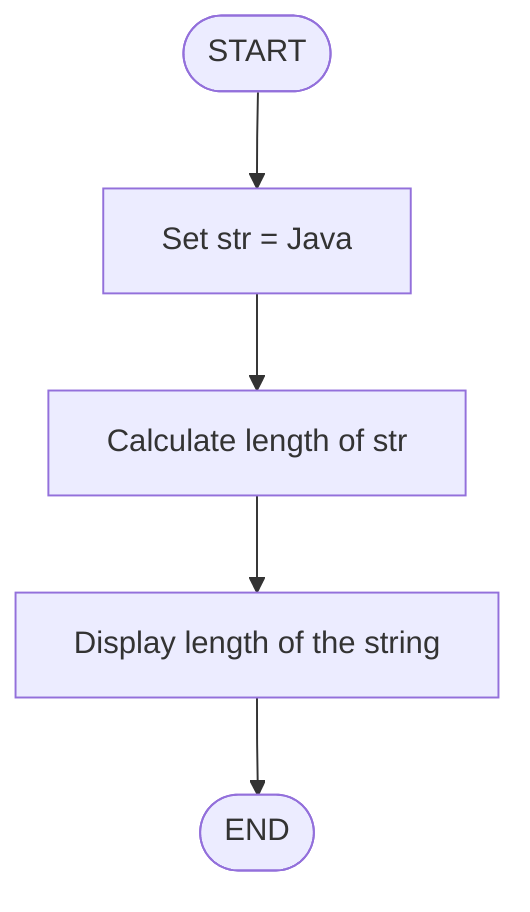
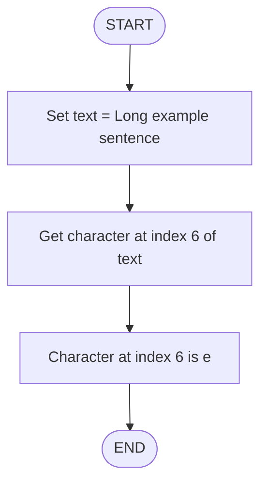

# Working with Strings.

## Exercises:

### Question 1.
What is the length of the String: "Java" ?

### Algorithm

- Start the program.

- Define a string variable str with value "Java".

- Measure the length of str.

- Print the length.

- End the program

### Pseudocode

```pgsql

START
   SET str = "Java"

   SET length = LENGTH(str)

   PRINT "Length of the string is: ", length

END
```

### Flowchart




### Question 2.

What char is at index position 6 in the following String:
"Long example sentence" ?

- Start

- Store the string → "Long example sentence"

- Directly read the character at index position 6

- Output that character

- End
```

```
### Flowchart


