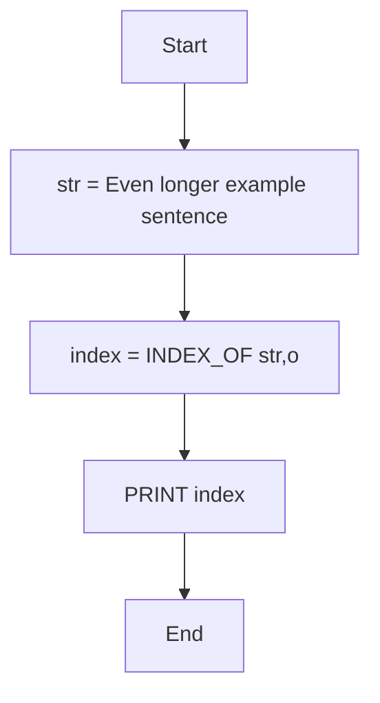
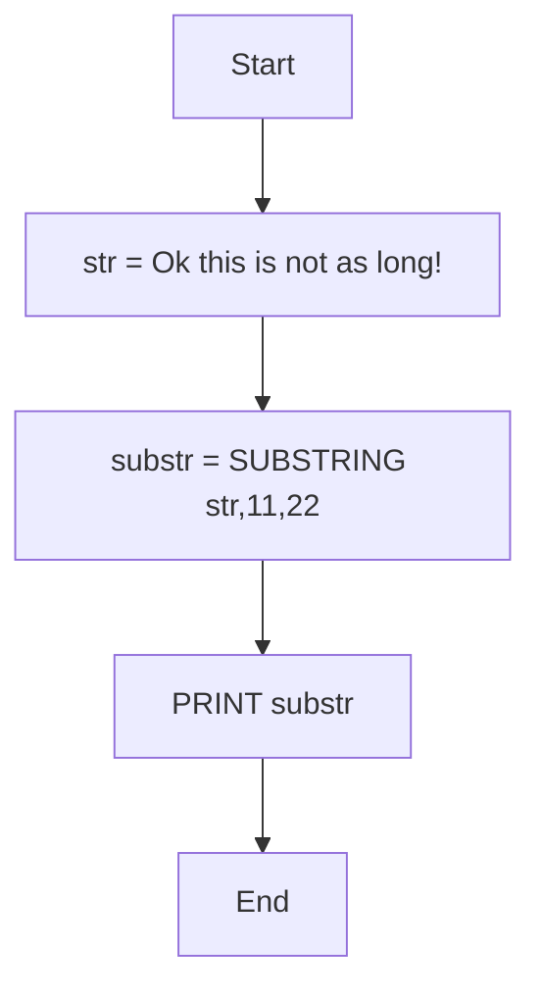
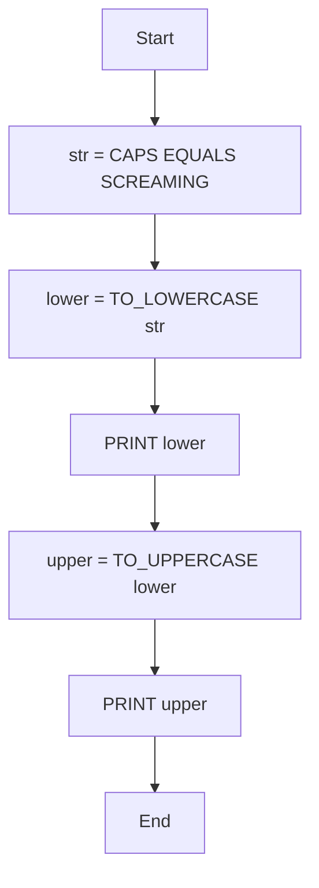
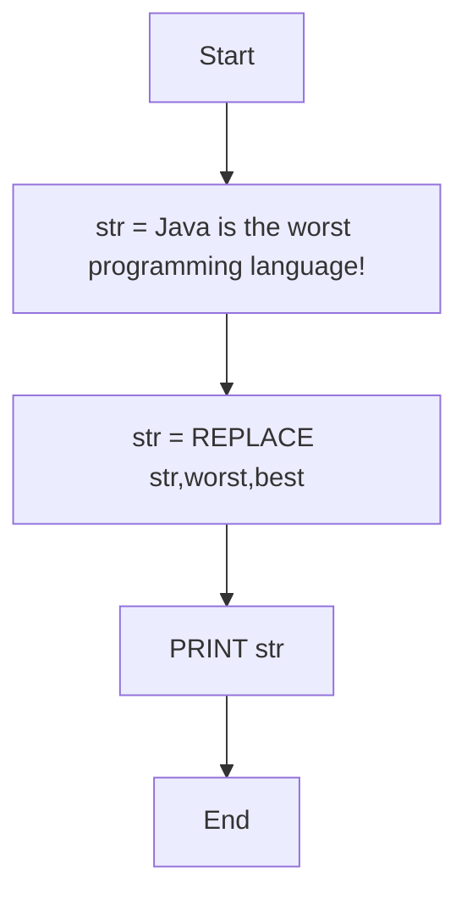
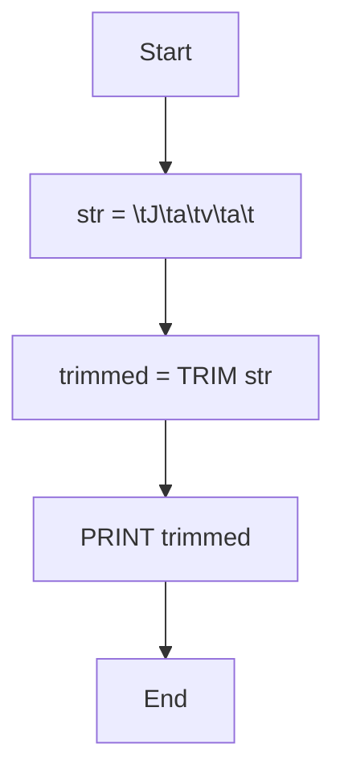
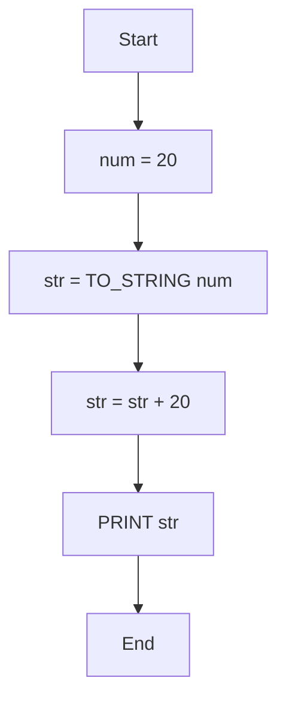
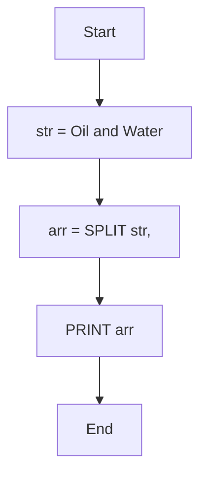
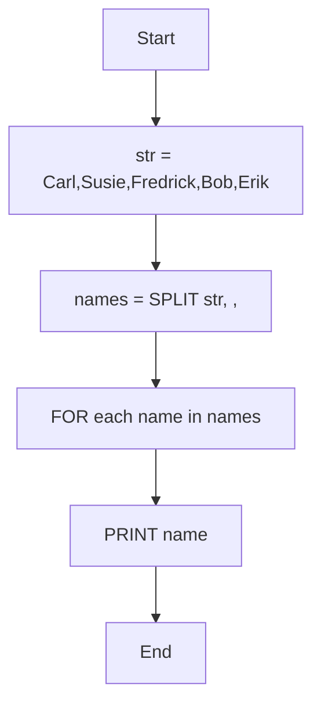
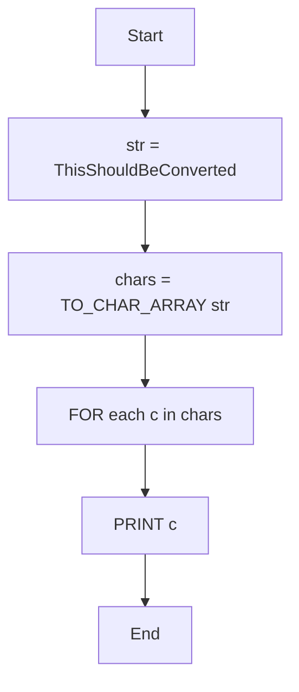
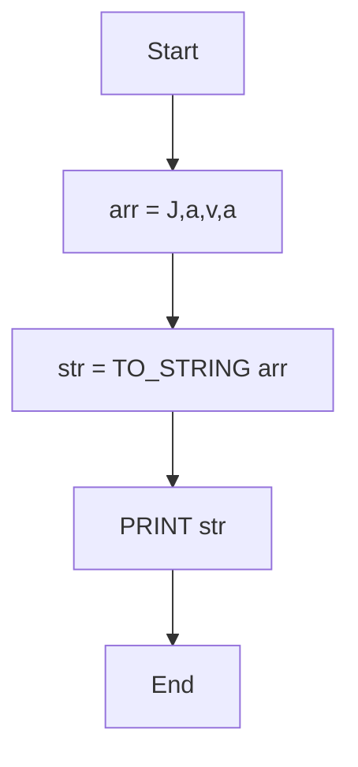

# Working with Strings.

## Exercises 1: Length of the String "Java"

### Question .
What is the length of the String: "Java" ?

### Algorithm

- Start the program.

- Define a string variable str with value "Java".

- Measure the length of str.

- Print the length.

- End the program

### Pseudocode

```pgsql

START
   SET str = "Java"
   SET length = LENGTH(str)
   PRINT "Length of the string is: ", length
END
```

### Flowchart


### Exercise 2: Char at index 6 in "Long example sentence"

### Question.
 What char is at index position 6 in the following String:
"Long example sentence" ?

### Algorith

- Start

- Store the string → "Long example sentence"

- Directly read the character at index position 6

- Output that character

- End

### Pseudocode

```pgsql
START
  str <- "Long example sentence"
  char <- str[6]
  PRINT char
END
```

### Flowchart


### Exercise 3 : Index of 'o' in "Even longer example sentence"

### Question.
What is the index position of 'o' in the following String:
"Even longer example sentence" ?

### Algorithm:

- Start

- Initialize string: str = "Even longer example sentence"

- Find index of 'o'

- Print index

- End

### Pseudocode:

```pgsql
START
  str <- "Even longer example sentence"
  index <- INDEX_OF(str, 'o')
  PRINT index
END
```

### Flowchart (Mermaid):



### Exercise 4: Substring "not as long"

### Question.
Given the following String: "Ok this is not as long!"
create a substring of only "not as long" (excluding the
exclamation point) and print it out.

### Algorithm:

- Start

- Initialize string: str = "Ok this is not as long!"

- Extract substring from index 11 to 22

- Print substring

- End

### Pseudocode:

```pgsql
START
  str <- "Ok this is not as long!"
  substr <- SUBSTRING(str, 11, 22)
  PRINT substr
END
````

### Flowchart:



### Exercise 5: Convert String to lowercase and back to uppercase

### Question.
Convert the following String: "CAPS EQUALS SCREAMING" to
lowercase and print it out. Then convert it back to
uppercase and print it out again.

### Algorithm:

- Start

- Initialize string: str = "CAPS EQUALS SCREAMING"

- Convert str to lowercase

- Print lowercase

- Convert str to uppercase

- Print uppercase

- End


### Pseudocode:

```pgsql
START
  str <- "CAPS EQUALS SCREAMING"
  lower <- TO_LOWERCASE(str)
  PRINT lower
  upper <- TO_UPPERCASE(lower)
  PRINT upper
END
```

### Flowchart:



### Exercise 6: Replace "worst" with "best"

### Question.
What is the output of the following String:
"\tJ\ta\tv\ta\t" after you trim it?

### Algorithm:

- Start

- Initialize string: str = "Java is the worst programming language!"

- Replace "worst" with "best"

- Print the new string

- End

### Pseudocode:

```pgsql
START
  str <- "Java is the worst programming language!"
  str <- REPLACE(str, "worst", "best")
  PRINT str
END
```

### Flowchart:



### Exercise 7: Trim "\tJ\ta\tv\ta\t"

### Question.
Convert the following String: "CAPS EQUALS SCREAMING" to
lowercase and print it out. Then convert it back to
uppercase and print it out again.

### Algorithm:

- Start

- Initialize string: str = "\tJ\ta\tv\ta\t"

- Trim leading and trailing whitespace (including tabs)

- Print the trimmed string

- End

### Pseudocode:

```pgsql
START
  str <- "\tJ\ta\tv\ta\t"
  trimmed <- TRIM(str)
  PRINT trimmed
END
```

### Flowchart:



### Exercise 8: Convert int 20 to String and append 20

### Question.
Parse the following int: 20 to a String and add a 20 to the
end of the String. Printing it out should return: "2020".

### Algorithm:

- Start

- Initialize int: num = 20

- Convert num to string

- Append "20" to the string

- Print the result ("2020")

- End

### Pseudocode:

```ps´gsql
START
  num <- 20
  str <- TO_STRING(num)
  str <- str + "20"
  PRINT str
END
```

### Flowchart:



### Exercise 9: Split "Oil and Water" into array

### Question.
Oil and water don't go well together. Given the String:
"Oil and Water", split them up into the words "Oil","Water"
and store them in a String array.

### Algorithm:

- Start

- Initialize string: str = "Oil and Water"

- Split str into words by space

- Store in array arr

- Print array elements

- End

### Pseudocode:

```pgsql
START
  str <- "Oil and Water"
  arr <- SPLIT(str, " ")
  PRINT arr
END
```

### Flowchart:



### Exercise 10: Split "Carl,Susie,Fredrick,Bob,Erik"

### Question.
Split the following String: "Carl,Susie,Fredrick,Bob,Erik"
into an array. Print out all names separately.

### Algorithm:

- Start

- Initialize string: str = "Carl,Susie,Fredrick,Bob,Erik"

- Split by comma into array names

- Print each name separately

- End

### Pseudocode:

```pgsql
START
  str <- "Carl,Susie,Fredrick,Bob,Erik"
  names <- SPLIT(str, ",")
  FOR each name in names
      PRINT name
END
```

### Flowchart:



### Exercise 11: Convert "ThisShouldBeConverted" to char array

### Question.
Convert the following String: "ThisShouldBeConverted" to
a char array. Iterate through the char array and print out
each element.

### Algorithm:

- Start

- Initialize string: str = "ThisShouldBeConverted"

- Convert str to char array chars

- Iterate through chars and print each element

- End

### Pseudocode:

```pgsql
START
  str <- "ThisShouldBeConverted"
  chars <- TO_CHAR_ARRAY(str)
  FOR each c in chars
      PRINT c
END
```

### Flowchart:



### Exercise 12: Convert char[] {'J','a','v','a'} to String

### Question.
 Convert the following char[]: {'J','a','v','a'} to a
String and print it out.

### Algorithm:

- Start

- Initialize char array: arr = {'J','a','v','a'}

- Convert arr to string str

- Print str

- End

### Pseudocode:

```
START
  arr <- {'J','a','v','a'}
  str <- TO_STRING(arr)
  PRINT str
END
```

### Flowchart:


