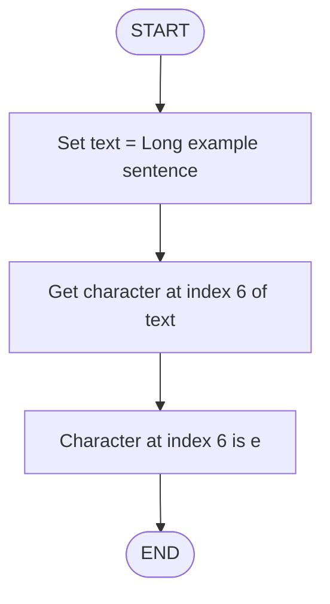

# Working with Strings.

## Exercises 1: Length of the String "Java"

### Question .
What is the length of the String: "Java" ?

### Algorithm

- Start the program.

- Define a string variable str with value "Java".

- Measure the length of str.

- Print the length.

- End the program

### Pseudocode

```pgsql

START
   SET str = "Java"
   SET length = LENGTH(str)
   PRINT "Length of the string is: ", length
END
```

### Flowchart


### Exercise 2: Char at index 6 in "Long example sentence"

### Question.
 What char is at index position 6 in the following String:
"Long example sentence" ?

### Algorith

- Start

- Store the string → "Long example sentence"

- Directly read the character at index position 6

- Output that character

- End

### Pseudocode

```pgsql
START
  str <- "Long example sentence"
  char <- str[6]
  PRINT char
END
```

### Flowchart



### Exercise 3 : Index of 'o' in "Even longer example sentence"

### Question.
What is the index position of 'o' in the following String:
"Even longer example sentence" ?

### Algorithm:

- Start

- Initialize string: str = "Even longer example sentence"

- Find index of 'o'

- Print index

- End

### Pseudocode:

```pgsql
START
  str <- "Even longer example sentence"
  index <- INDEX_OF(str, 'o')
  PRINT index
END
```

### Flowchart (Mermaid):


### Exercise 4: Substring "not as long"

### Question.
Given the following String: "Ok this is not as long!"
create a substring of only "not as long" (excluding the
exclamation point) and print it out.

### Algorithm:

- Start

- Initialize string: str = "Ok this is not as long!"

- Extract substring from index 11 to 22

- Print substring

- End

### Pseudocode:

```pgsql
START
  str <- "Ok this is not as long!"
  substr <- SUBSTRING(str, 11, 22)
  PRINT substr
END
````

### Flowchart:


### Exercise 5: Convert String to lowercase and back to uppercase

### Question.
Convert the following String: "CAPS EQUALS SCREAMING" to
lowercase and print it out. Then convert it back to
uppercase and print it out again.

### Algorithm:

- Start

- Initialize string: str = "CAPS EQUALS SCREAMING"

- Convert str to lowercase

- Print lowercase

- Convert str to uppercase

- Print uppercase

- End


### Pseudocode:

```pgsql
START
  str <- "CAPS EQUALS SCREAMING"
  lower <- TO_LOWERCASE(str)
  PRINT lower
  upper <- TO_UPPERCASE(lower)
  PRINT upper
END
```

### Flowchart:


### Exercise 6: Replace "worst" with "best"

### Question.
Correct the following String: "Java is the worst
programming language!" by replacing the (obviously
incorrect) word "worst" with the word "best". Then print
out the sentence.

### Algorithm:

- Start

- Initialize string: str = "Java is the worst programming language!"

- Replace "worst" with "best"

- Print the new string

- End

### Pseudocode:

```pgsql
START
  str <- "Java is the worst programming language!"
  str <- REPLACE(str, "worst", "best")
  PRINT str
END
```

### Flowchart:


